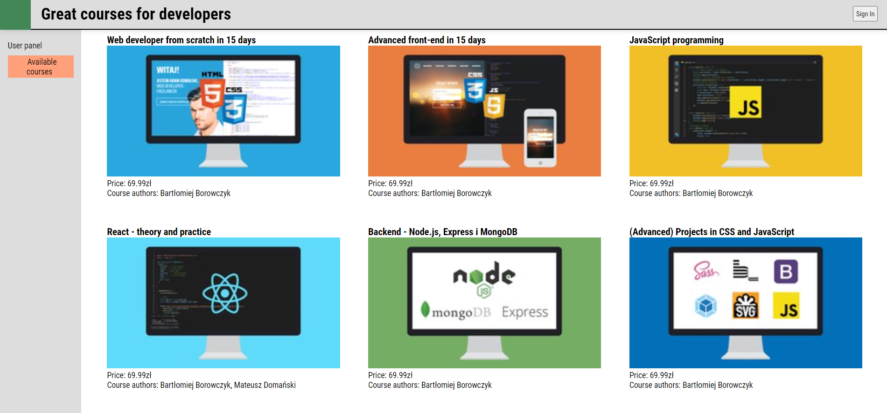
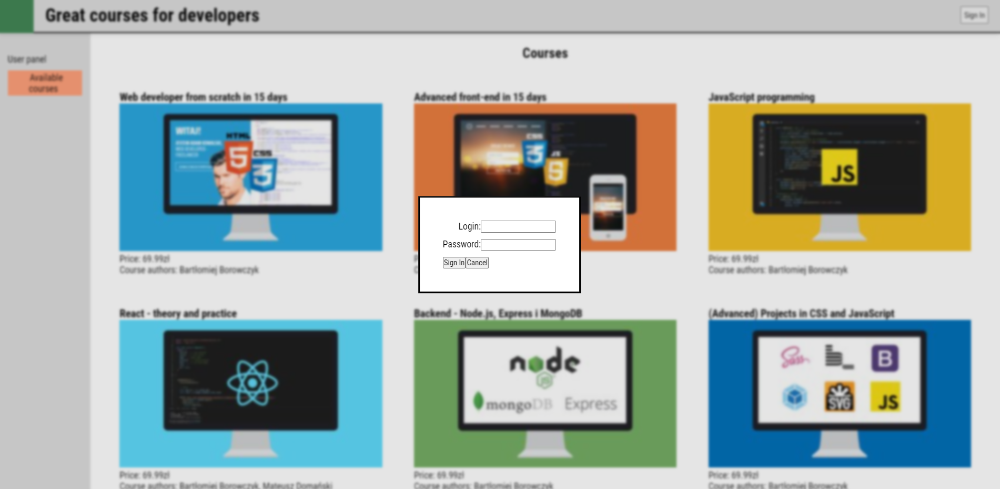
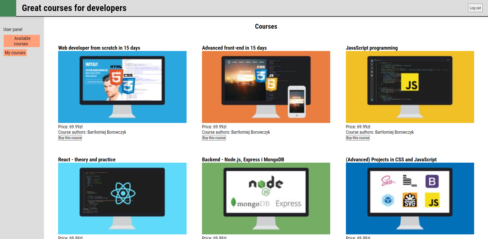
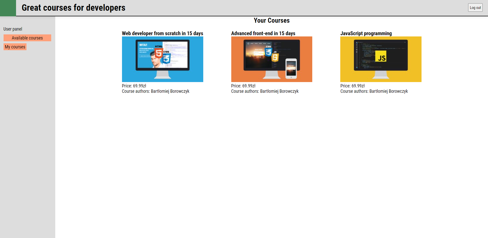
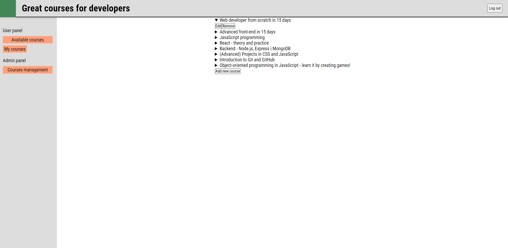
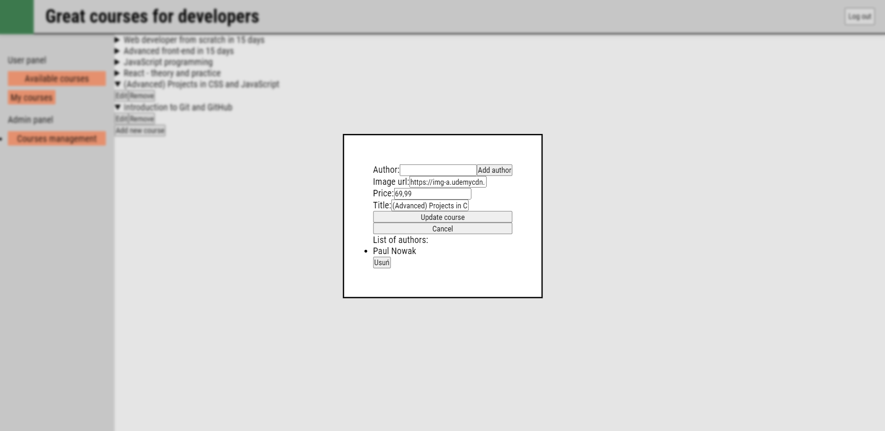
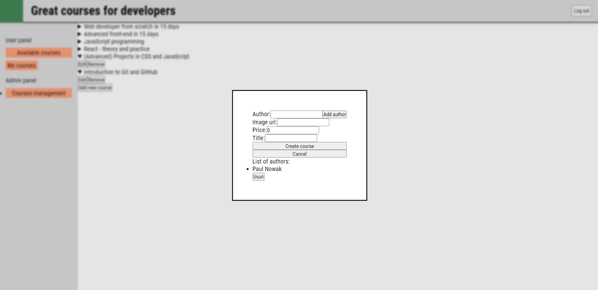

# Crypto Tracker

I used React, Sass and Axios libraries to write this application. This application fetch data from server (backend folder).

## Home Page

The user can see all available courses.

## Home page after logging in

If the user logs in, he will be able to purchase the course.

## My courses

In the my courses tab, you can see the courses we have purchased

## Admin panel

If we log in to the admin panel, we can manage the courses.

We can add, delete and edit content. We can manage the list of authors too.

In Admin Panel we can add new courses.

